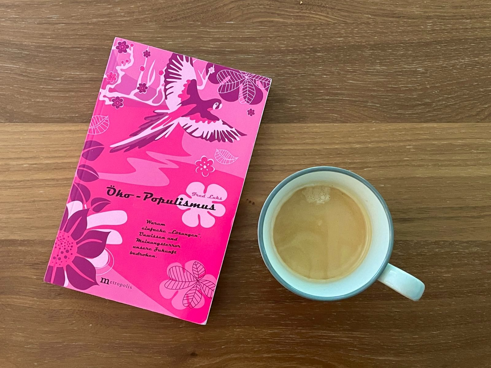

Am 5. Juni war **Weltumwelttag**, eine gute Gelegenheit um wieder einmal darüber nachzudenken, wie mein Beitrag zum Thema aussieht. Gedanklich bin ich meine Gewohnheiten durchgegangen und habe überlegt, welche Akzente ich im Alltag setze, um „umweltverträglicher“ und „ressourcenschonender“ zu leben. Vegetarische Ernährung, per Öffis und per Pedes durch die Stadt, Reduktion von Autofahrten und Flugreisen, Reduktion im Konsumverhalten etc. Lauter ökologisch dominierte Einzelhandlungen.

Generell nehme ich die Diskussion um Nachhaltigkeit ökologisch dominiert wahr; die soziale und wirtschaftliche Facette ist nur peripher gegeben. Das habe ich als Anlass genommen, um den **Öko-Populismus von Fred Luks** ein zweites Mal zu lesen und das Thema Nachhaltigkeit aus der Sicht eines Ökonomen zu verstehen.

### Was habe ich mir daraus mitgenommen?
- Eine nachhaltige Entwicklung kann gelingen im Dreiklang von Reduktion, Innovation und Transformation; Reduktion des globalen Ressourcen- und Energieverbrauchs, technische Innovation um mehr Wert aus der Natur zu gewinnen und tiefgreifende gesellschaftliche Veränderungen. 
- Das hat Implikationen auf Freiheit, Demokratie und unser gängiges Verständnis vom „schönen Leben“ und wirft Grundsatzfragen auf. Potentielle Einschnitte und Eingriffe in gesellschaftliche Strukturen und Prozesse und die Assoziation vom Begriff Nachhaltigkeit mit Verzicht, Reduktion, Mäßigkeit, Spaßverderben. 
- Wie kann „Nachhaltigkeit“ gelingen? Eine zielsichere Planung wird es nicht geben, eine Reihe von Maßnahmen wird notwendig sein. Es ist ein Suchen, Lernen, Streiten, Ausprobieren; ein Mix von:
    - Eindrucksvollen Geschichten, um zu beschreiben, dass eine andere - bessere & nachhaltige - Zukunft möglich ist.
    - Daten, Zahlen und Fakten rund um klimatologische Maßnahmen.
    - Einer Wissenschaft, die als Katalysator für gesellschaftliche Veränderungsprozesse wirkt.
    - Gesellschaftlicher Verantwortung von Unternehmen.
    - Ein Mehr von Reduktion, Entschleunigung und Exnovation.
    - Ein Hin zu Maß und Schrumpfung in materieller Sicht.
    - Ein Mehr an Kreativität, nicht nur technisch, auch kulturell und sozial.
    - Und Pluralismus: Eine lebendige, intellektuell reichhaltige Debatte, im vollem Bewusstsein, dass es in einer pluralistischen Demokratie keine perfekten Lösungen für alles und jeden gibt.

