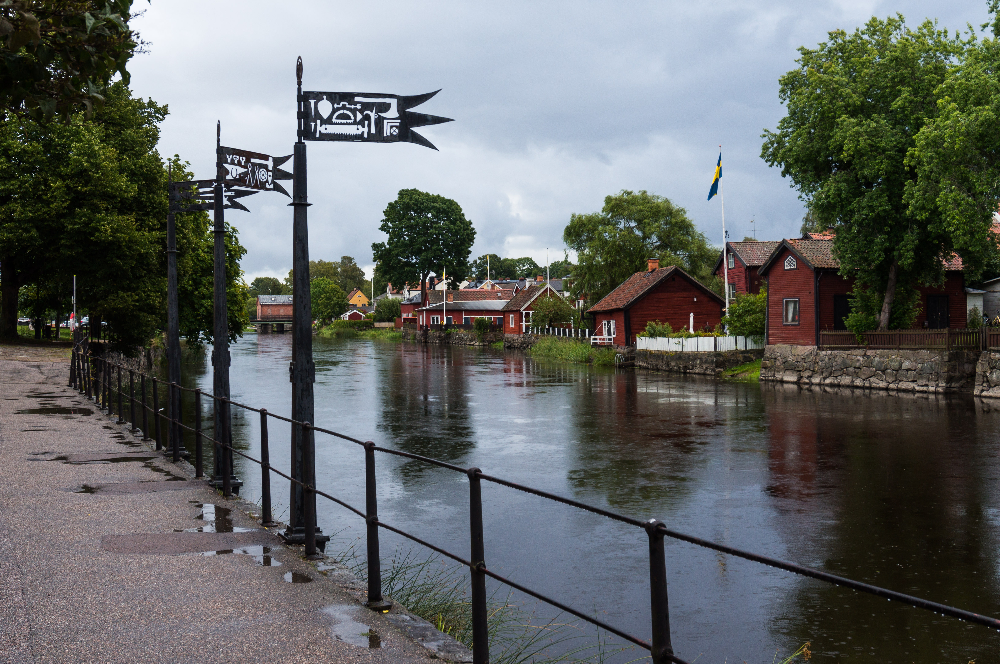

**Half of the year 2022 is gone, time to reflect on the progress of my 2022 priorities.** What helps me to stay on track? **Habits** - daily activities that are well incorporated in my daily life.

A good resource of inspiration for building habits is James Clear‘s book **„Atomic habits“**. I have read the book around one year ago and still come back from time to time to think about my main take-aways from the book:

1. **Small things make the difference in the long run**: It is not about once-in-a-lifetime transformations, it is about the daily activities, the daily habits that count. Example: I am in a good physical shape because I stick to a very regular sports routine since years. Is it always fun and joyful? Definitely not, but it certainly pays off in the long run. 

1. **Habits shape identity**: The most effective way to change habits is not to focus on goals or accomplishments, but on which type of person I want to become. Example: When I started my vegetarian diet quite some years ago, my goal was not to eat no meat for a certain period of time, I decided to be a vegetarian. With that mindset it is easy to decline a meat-only barbecue; I am a vegetarian, no room for discussion about any exceptions.

Let me continue to make another all-star day in my core habit tracker :).

